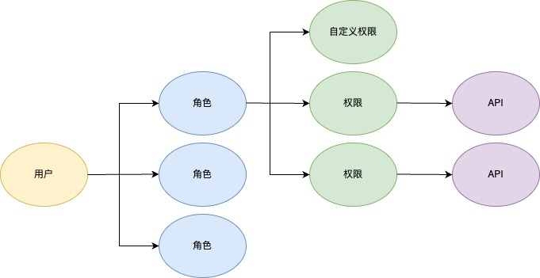

    MT-AUTH

  <strong>用户、角色、权限、 应用、 API、多租户、一站式管理云平台</strong>

  MT-AUTH是一款基于Spring Boot、OAuth2、事件驱动的多租户权限管理(RBAC)系统，集成Spring Cloud Gateway网关提供API鉴权，缓存，跨域，CSRF防护等常用功能

    

# 云版本

- [官方地址](https://www.duoshu.xyz/login)
- 演示账号：demo1@duoshu.xyz 密：Password1!
- 演示账号：demo2@duoshu.xyz 密：Password1!
- 演示账号：superadmin@duoshu.xyz 密：Password1!
- **注：当前版本为beta版，不保证数据安全并且随时回滚**

# 应用场景

个人请使用云版本
- 避免从零构建权限管理系统
- 希望专注于业务
- 开放API给其它开发者使用

企业请单独部署

- 项目之间用户通用，需要统一管理
- 项目由不同的团队管理，团队相对独立
- 用户在不同项目中有不同权限
- 统一管理项目、应用与API
- 项目之间需要共享API

# 项目特点

- 基于事件的系统架构
- 多租户
- 应用，API与用户管理
- JWT不对称钥匙
- OAuth2
- 站内信，短信，邮件通知
- 用户密码重置, 注册码注册
- 已签发JWT回收
- API缓存，跨域，CSRF防护，压缩，隐藏系统错误信息
- API记录与分析
- 多因素认证(MFA)

# 项目示意图

# 基于角色的权限控制(RBAC)示意图

# 技术栈

| 模块                  | 概述                     | 技术栈                                                            |  
|:--------------------|:-----------------------|:---------------------------------------------------------------|
| mt-access           | 用户, 应用与API管理, 注册中心, 通知 | Spring Boot, JWT, OAuth2, Redis, RabbitMQ, Spring Cloud Eureka |
| mt-proxy            | API网关                  | Spring Boot, Spring Cloud Gateway, Redis, RabbitMQ             |
| mt-ui               | UI                     | Angular                                                        |
| mt-common           | 通用Utility              | Spring Boot                                                    |
| mt-integration-test | 集成测试                   | Spring Boot Test                                               |

# 演示项目
- [NodeJs](./mt-sample/nodejs)
- [Spring Boot](./mt-sample/spring-boot)
# 咨询与合作
请发送邮件至: duoshu2023@163.com