    MT-AUTH

  <strong>MT-AUTH是一款多租户权限管理系统，包含用户管理与API路由、共享、鉴权、缓存、跨域、安全防护等功能</strong>

    

# 云版本

- [官方地址(www.letsauth.cloud)](https://www.letsauth.cloud/login)
- 演示账号：demo@sample.com 密：Password1!
- 演示账号：superadmin@sample.com 密：Password1!
- **注：当前版本为beta版，不保证数据安全并且随时回滚**
# 示意图

# 应用场景

个人 - 云版本

- 避免从零构建用户权限管理系统，更加专注与业务需求
- 与其它开发者共享API

企业 - 请单独部署

- 项目之间用户通用，需要统一管理
- 项目由不同的团队管理，团队相对独立
- 用户在不同项目中有不同权限
- 统一管理项目、应用与API
- 项目之间需要共享API

# 项目特点

- 事件驱动
- 基于角色的权限控制(RBAC)
- 多租户
- 不对称密匙
- OAuth2
- 站内信，短信，邮件通知
- 用户密码重置, 注册码注册
- 已签发JWT回收
- API路由、缓存、跨域CORS、CSRF防护、压缩、隐藏系统错误信息
- API记录与分析
- 多因素认证(MFA)

# 技术栈

| 模块                  | 概述                     | 技术栈                                                            |  
|:--------------------|:-----------------------|:---------------------------------------------------------------|
| mt-access           | 用户, 应用与API管理, 注册中心, 通知 | Spring Boot, JWT, OAuth2, Redis, RabbitMQ, Spring Cloud Eureka |
| mt-proxy            | API网关                  | Spring Boot, Spring Cloud Gateway, Redis, RabbitMQ             |
| mt-ui               | UI                     | Angular                                                        |
| mt-common           | 通用Utility              | Spring Boot                                                    |
| mt-integration-test | 集成测试                   | Spring Boot Test                                               |

# 演示项目
- [NodeJs](./mt-sample/nodejs)
- [Spring Boot](./mt-sample/spring-boot)
# 咨询与合作
请发送邮件至: letsauth@163.com
# 环境信息
- 操作系统: Ubuntu  18.04 64bit
- Java: java version "11.0.14" 2022-01-18 LTS
- JDK: hirokimatsumoto/alpine-openjdk-11
- Maven: maven:3.6.3-jdk-11