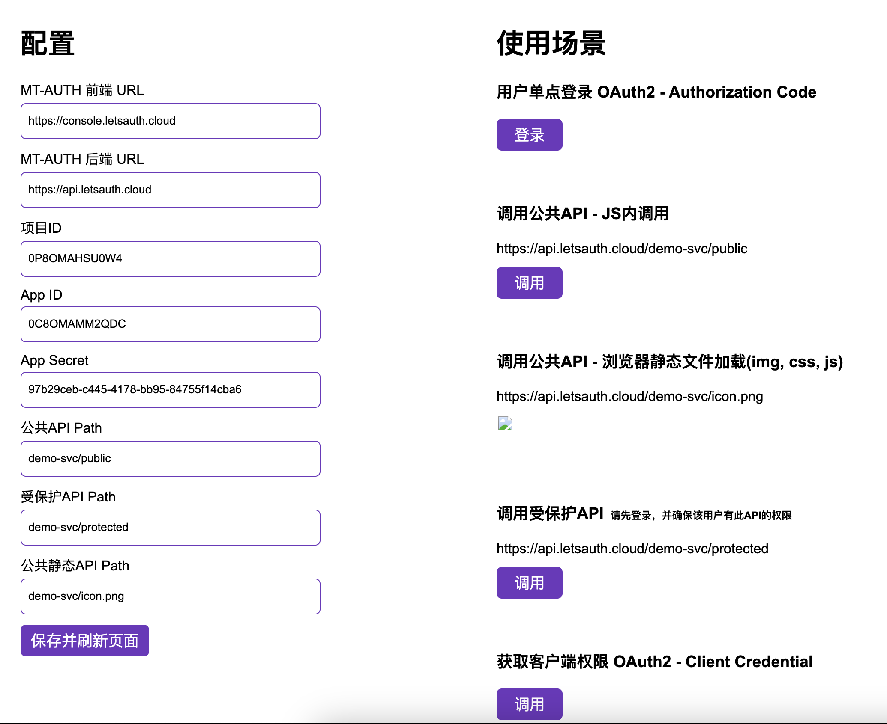

# Cloud
MT-AUTH官方云版本，快速集成应用

# 准备工作
基础的Spring或NodeJs知识

# 注册/登录账号
1. 打开 [登录页面](https://console.letsauth.cloud/login)
2. 输入手机号、邮箱或者用户名密码
3. 点击登录/注册


# 本地演示 - NodeJs或Spring Boot

## NodeJs
1. 切换至目录
   ```shell
    cd ./mt-auth/mt-sample/nodejs
   ```
2. 安装
    ```shell
      npm install 
    ```
3. 启动
    ```shell
    npm start
    ```
4. 打开 [http://localhost:3000](http://localhost:3000)



## Spring Boot 本地
1. 切换至目录
   ```shell
    cd ./mt-auth/mt-sample/spring-boot
   ```
2. 安装
    ```shell
      mvn clean package 
    ```
3. 启动
    ```shell
    java -jar ./target/sample-spring-boot.jar
    ```
4. 打开 [http://localhost:3000](http://localhost:3000)

## Spring Boot 服务器
1. 将mt-sample/spring-boot打包并部署在您的服务器上
2. 记下调用地址，例如http://x.x.x.x:3000
3. 登录演示账户demo@sample.com
4. 左侧导航栏点击->演示项目->应用
5. 找到演示后端应用，点击编辑按钮，更改路由地址为记录下的调用地址
6. 保存并等待约1分钟缓存刷新
7. 打开[http://x.x.x.x:3000](http://x.x.x.x:3000)
