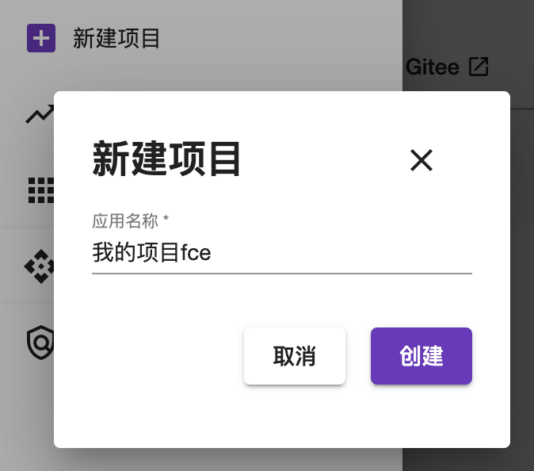
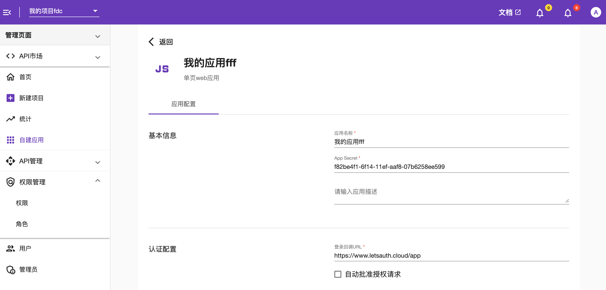

# Docker
在Docker上运行MT-AUTH
# 准备工作
请确保Docker已安装并且可运行
# 启动 MT-AUTH
在terminal输入Docker命令已启动MT-AUTH
```shell
docker todo
```
MT-AUTH将会使用port 4300(前端)与8111(后端)

# 登录
打开MT-AUTH[登录页面](http://localhost:4300/login)

登录系统管理员账号 
- 用户名：admin@sample.com
- 密码：Password1!


# 创建项目
项目等价于租户，是权限管理的最小单位，租户管理员可以为每个项目配置不同的角色，权限，应用，API等。MT-AUTH默认包含项目main, 请仅使用它来管理MT-AUTH。

##### 创建您的第一个项目

1. 打开 [控制台](http://localhost:4300)
2. 打开左侧导航栏并点击创建项目
3. 在名称一栏输入：我的项目
4. 点击创建
   


# 创建用户
在MT-AUTH中用户是唯一的存在，项目仅管理用户与项目的关联关系
##### 创建您的第一个用户
1. 打开 [登录页面](http://localhost:4300/login)
2. 输入手机号、邮箱或者用户名密码
3. 点击登录/注册


# 创建应用
将您的应用添加到MT-AUTH中来实现用户单点登录

1. 打开 [登录页面](http://localhost:4300/login)
2. 在上方导航栏中选择您所创建的项目
3. 在左侧导航栏中选择"自建应用"
4. 输入应用名称，选择"单页Web应用"
5. 在登录回调URL中输入"https://www.letsauth.cloud/app"
6. 点击创建



您可以使用MT-AUTH官网自带的SPA应用来验证您的应用是否创建成功
1. 打开您创建的应用，找到项目ID，App ID，App Secret
2. 打开[https://www.letsauth.cloud/app](https://www.letsauth.cloud/app) 
3. 将项目ID，App ID, App Secret替换成对应的值
4. 点击登录，您将通过本地的MT-AUTH验证您的账户并获取Token

# 下一步
体验MT-AUTH云版本来缩短您的开发周期，提升开发体验